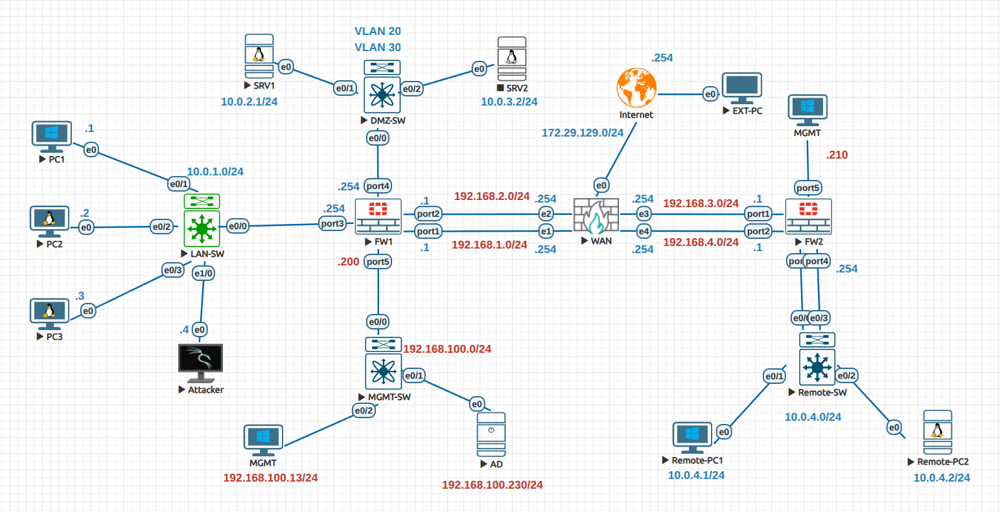

# FortiGate FCP (NSE 4) Labs

Hands-on labs and notes from my preparation for the **Fortinet Certified Professional – FortiGate Administrator (FortiOS 7.6)** exam, formerly known as **NSE 4**.

Lab environment built in EVE-NG, based on Ahmad Ali's Udemy course *Fortinet NSE 4 – FortiOS 7.6 Administrator Training*, which is split into two parts:

- [Part 1 of 2](https://www.udemy.com/course/fortinet-nse-4-fortios-76-administrator-training-part-12/) – in progress
- [Part 2 of 2](https://www.udemy.com/course/fortinet-nse-4-fortios-76-administrator-training-part-22/) – planned

> **Note:** The lab runs **FortiOS 7.0.9** (evaluation VM, as suggested by the instructor) rather than 7.6. Concepts are the same, with minor GUI differences.

This repo contains my own configurations, verification outputs, and troubleshooting notes.

## Topology

*Some later labs modify this topology; those changes are shown in the relevant section folders.*

## IP Addressing

### Firewalls

| Device | Interface | IP / Subnet | Connects to |
|---|---|---|---|
| FW1 | port1 (WAN-1) | 192.168.1.1/24 | WAN router e1 (.254) |
| FW1 | port2 (WAN-2) | 192.168.2.1/24 | WAN router e2 (.254) |
| FW1 | port3 (LAN) | 10.0.1.254/24 | LAN switch |
| FW1 | port4 (DMZ) | VLAN subinterfaces (Section 5) | DMZ switch – VLAN 20 / VLAN 30 |
| FW1 | port5 (MGMT) | 192.168.100.200/24 | Management switch |
| FW2 | port1 | 192.168.3.1/24 | WAN router e3 (.254) |
| FW2 | port2 | 192.168.4.1/24 | WAN router e4 (.254) |
| FW2 | port3 / port4 | 10.0.4.254/24 | Remote LAN switch |
| WAN router | e0 | 172.29.129.0/24 | Internet |

*FW2 details will be confirmed as it is configured later in the course.*

### Networks and Hosts

| Network | Subnet | Hosts |
|---|---|---|
| LAN | 10.0.1.0/24 | PC1 (.1), PC2 (.2), PC3 (.3), Attacker (.4) |
| DMZ – VLAN 20 | 10.0.2.0/24 | SRV1 (10.0.2.1) |
| DMZ – VLAN 30 | 10.0.3.0/24 | SRV2 (10.0.3.2) |
| Management | 192.168.100.0/24 | MGMT PC (.13), AD server (.230) |
| Remote LAN | 10.0.4.0/24 | Remote-PC1 (.1), Remote-PC2 (.2) |

## Progress

### Part 1
- [x] Lab setup (EVE-NG)
- [x] [Section 3 – System & Interface Configuration](03-system-and-interfaces/)
- [ ] Section 4 – Routing & ECMP
- [ ] Section 5 – VLANs & Zones
- [ ] Section 6 – NAT
- [ ] Section 7 – Firewall Policies
- [ ] Section 8 – Certificate Operations

### Part 2 (planned)
Course: [Part 2 of 2](https://www.udemy.com/course/fortinet-nse-4-fortios-76-administrator-training-part-22/)

- [ ] Firewall Authentication
- [ ] Fortinet Single Sign-On (FSSO)
- [ ] Basic Administration
- [ ] FW2 Setup
- [ ] SSL & IPsec VPN
- [ ] SD-WAN
- [ ] DHCP
- [ ] Fundamental Maintenance
- [ ] Diagnostics & Troubleshooting
- [ ] Logging & Monitoring
- [ ] High Availability
- [ ] FortiSASE
- [ ] FortiGate in the Cloud
